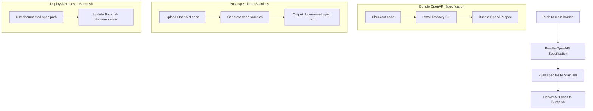
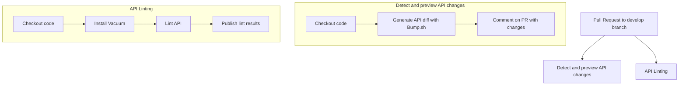
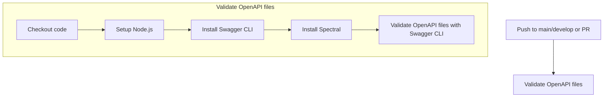
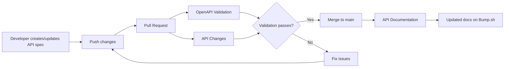

# GitHub Workflows Documentation

This document provides visual representations of the GitHub workflows used in this repository.

## API Documentation Workflow

This workflow deploys the API documentation to Bump.sh when changes are pushed to the main branch.

## API Changes Workflow

This workflow runs on pull requests to the develop branch to detect and preview API changes.

## OpenAPI Validation Workflow

This workflow validates OpenAPI files when they are changed in a push or pull request.

## Workflow Relationships

This diagram shows how the three workflows relate to each other in the development process.

