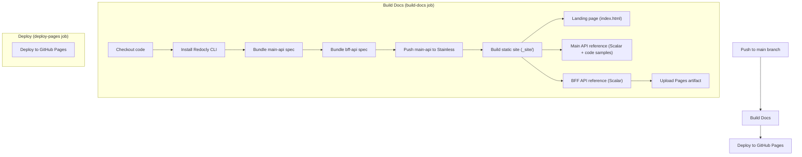
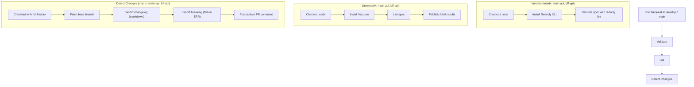
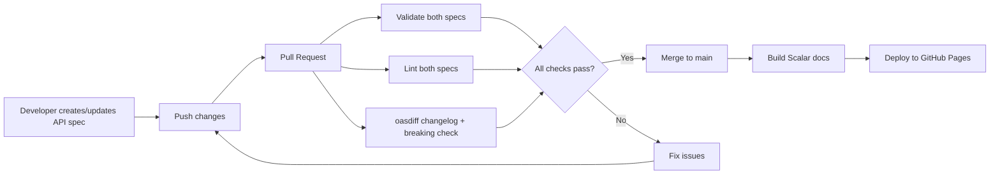

# GitHub Workflows Documentation

This document provides visual representations of the GitHub workflows used in this repository.

## API Documentation Workflow (`api-docs.yml`)

Deploys interactive API documentation to **GitHub Pages** using [Scalar](https://github.com/scalar/scalar) when changes are pushed to the `main` branch. Also enriches the Main API spec with code samples via [Stainless](https://stainless.com).

```mermaid
flowchart TD
    A[Push to main branch] --> B[Build Docs]
    B --> C[Deploy to GitHub Pages]

    subgraph "Build Docs (build-docs job)"
    B1[Checkout code] --> B2[Install Redocly CLI]
    B2 --> B3[Bundle main-api spec]
    B3 --> B4[Bundle bff-api spec]
    B4 --> B5[Push main-api to Stainless]
    B5 --> B6["Build static site (_site/)"]
    B6 --> B6a["Landing page (index.html)"]
    B6 --> B6b["Main API reference (Scalar + code samples)"]
    B6 --> B6c["BFF API reference (Scalar)"]
    B6c --> B7[Upload Pages artifact]
    end

    subgraph "Deploy (deploy-pages job)"
    C1[Deploy to GitHub Pages]
    end
```

### Pages structure

| URL path       | Content                                        |
| -------------- | ---------------------------------------------- |
| `/`            | Landing page with links to both API references |
| `/main-api/`   | Scalar reference for the Main API              |
| `/bff-api/`    | Scalar reference for the BFF API               |

## API Changes Workflow (`api-changes.yml`)

Runs on pull requests to `develop` or `main`. Validates, lints, and generates a changelog diff for each API spec using [oasdiff](https://github.com/oasdiff/oasdiff). Posts the diff as a PR comment.

```mermaid
flowchart TD
    A[Pull Request to develop / main] --> B[Validate]
    B --> C[Lint]
    C --> D[Detect Changes]

    subgraph "Validate (matrix: main-api, bff-api)"
    B1[Checkout code] --> B2[Install Redocly CLI]
    B2 --> B3[Validate spec with redocly lint]
    end

    subgraph "Lint (matrix: main-api, bff-api)"
    C1[Checkout code] --> C2[Install Vacuum]
    C2 --> C3[Lint spec]
    C3 --> C4[Publish JUnit results]
    end

    subgraph "Detect Changes (matrix: main-api, bff-api)"
    D1[Checkout with full history] --> D2[Fetch base branch]
    D2 --> D3["oasdiff changelog (markdown)"]
    D3 --> D4["oasdiff breaking (fail on ERR)"]
    D4 --> D5[Post/update PR comment]
    end
```

## Workflow Relationships

```mermaid
flowchart LR
    A[Developer creates/updates API spec] --> B[Push changes]
    B --> C[Pull Request]
    C --> D[Validate both specs]
    C --> E[Lint both specs]
    C --> F[oasdiff changelog + breaking check]
    D --> G{All checks pass?}
    E --> G
    F --> G
    G -->|Yes| H[Merge to main]
    G -->|No| I[Fix issues]
    I --> B
    H --> J[Build Scalar docs]
    J --> K[Deploy to GitHub Pages]
```
